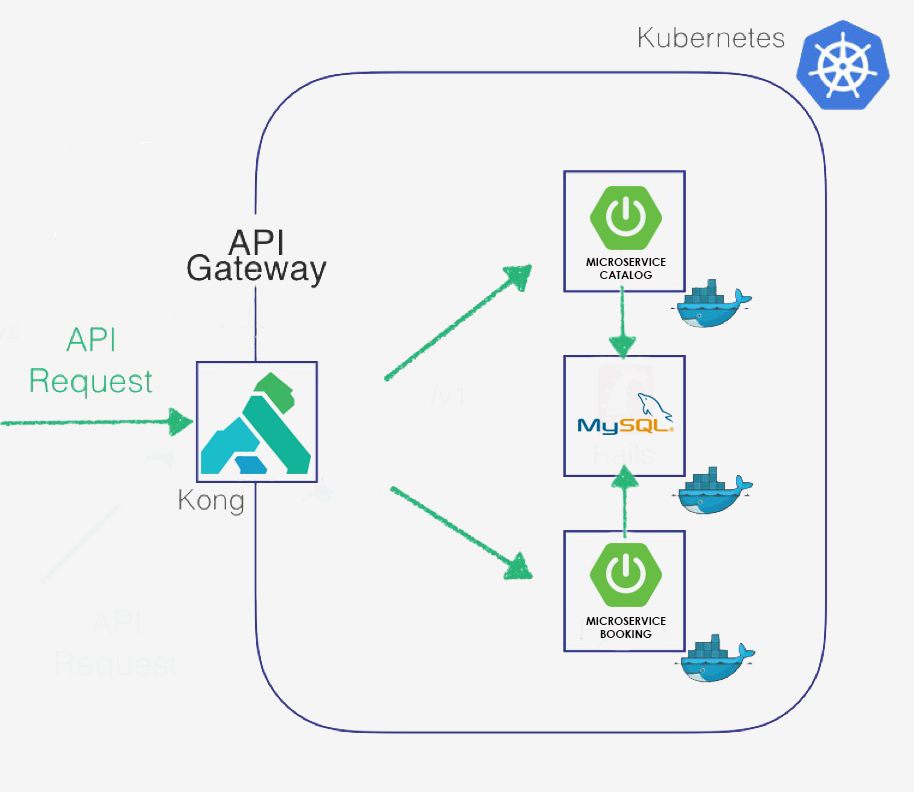

# Description
This project is an implementation of a microservices architecture. It demonstarates how spring boot applications can be deployed on top of kubernetes.
The application uses a two Java 8/Spring Boot microservices, the first returns a list of cars that a user can rent and the second contains the contracts submitted by the user.
The [frontend](https://github.com/ziedYazidi/Dynamic-Form-Generator) is an Angular app that lists the cars and submits a contract once a car is chosen. 
The backend uses a MySQL database to store the cars and the contracts.


# Architecture



Concerning the database, It is recommended to keep each microservice’s persistent data private to that service and accessible only via its API. I used a Private-tables-per-service approach which states that each service must own a set of tables that must only be accessed by that service.
You can read more about this in y [Chris Richardson Website](https://microservices.io/patterns/data/database-per-service.html) 

# Prerequisite

* Install [Minikube](https://kubernetes.io/docs/tasks/tools/install-kubectl/#install-kubectl)

* Create a Kubernetes cluster with [Minikube](https://kubernetes.io/docs/getting-started-guides/minikube) for local testing.

* Install the command-line tool [Kubectl](https://console.bluemix.net/openwhisk/learn/cli/) to manage and deploy applications on kubernetes.

# Steps
1. [Clone the repo](#1-clone-the-repo)
2. [Set up the Kong Ingress Controller](#2-Set-up-the-Kong-Ingress-Controller)
3. [Create the Database service](#3-create-the-database-service)
4. [Create the Spring Boot Microservices](#4-create-the-spring-boot-microservices)
5. [Deploy the Microservices](#5-deploy-the-microservices)
6. [Access the microservices via Kong](#6-Access-the-microservices-via-Kong)

### 1. Clone the repo

Clone this repository. In a terminal, run:

```
$ git clone https://github.com/ziedYazidi/microservices-rent-car-example.git
```

### 2. Set up the Kong Ingress Controller
In this step, we want to integrate Kong with the Kubernetes Ingress Controller spec, this way kong ties directly to the Kubernetes lifecycle. As applications are deployed and new services are created, Kong will automatically live configure itself to serve traffic to these services.

Check this [Kong repository](https://github.com/Kong/kubernetes-ingress-controller/blob/master/deploy/minikube.md) to set up Kong Ingress Controller

### 3. Create the Database service
The backend consists of a MySQL database and the Spring Boot app. Each
microservice has a Deployment and a Service. The deployment manages
the pods started for each microservice. The Service creates a stable
DNS entry for each microservice so they can reference their
dependencies by name.

* To use MySQL in container

```bash
$ kubectl create -f account-database.yaml
service "rent-car-database" created
deployment "rent-car-database" created
```
Default credentials are already encoded in base64 in secrets.yaml.

```
$ kubectl apply -f secrets.yaml
secret "rent-car-credentials" created
```

You can access the database pod as follows:
```
$ kubectl exec -it rent-car-database-XXX bash
root@rent-car-database-XXX:/# 
```

### 4. Create the Spring Boot Microservices
You will need to have [Maven installed in your environment](https://maven.apache.org/index.html).
If you want to modify the Spring Boot apps, you will need to do it before building the Java project and the docker image.

The Spring Boot Microservices are the **Catalog** and the **Booking**.

**Catalog** is a Spring Boot app configured to use a MySQL database. The configuration is located in `Catalog/src/main/resources/application.properties` in `spring.datasource.*`

The `application.properties` is configured to use MYSQL_DB_* environment variables. These are defined in the `catalog-service.yaml` file. It is already configured to get the values from the Kubernetes Secrets that was created earlier.

Same thing for the **Booking** Microservice, the configuration is located in `Catalog/src/main/resources/application.properties` in `spring.datasource.*` and MYSQL_DB_* environment variables are defined in the `booking-service.yaml` file.

* Build your projects using Maven

After Maven has successfully built the Java project, you will need to build the Docker image using the provided `Dockerfile` in their respective folders.

```bash
Go to containers/Catalog
$ mvn package

Go to containers/Booking
$ mvn package

```

* Build your Docker images for Spring Boot services

*The images [are pushed in Docker hub](https://docs.docker.com/datacenter/dtr/2.2/guides/user/manage-images/pull-and-push-images).*

You can check my dockerhub namespace [here](https://hub.docker.com/u/ziedyazidi/)

```bash
$ docker build -t <YOUR_NAMESPACE>/catalog-service .
$ docker build -t <YOUR_NAMESPACE>/booking-service .
$ docker push <YOUR_NAMESPACE>/catalog-service
$ docker push <YOUR_NAMESPACE>/booking-serivce
```

* Modify *catalog-service.yaml* and *booking-service.yaml* to use your image

Once you have successfully pushed your images, you will need to modify the yaml files to use your images.
```yaml
# catalog-service.yaml
  spec:
    containers:
      - image: <namespace>/catalog-service # replace with your image name
```

```yaml
# booking-service.yaml
  spec:
    containers:
      - image: <namespace>/booking-service # replace with your image name
```


`


### 5. Deploy the Microservices

* Deploy Spring Boot Microservices

```bash
$ kubectl create -f catalog-service.yaml
service "catalog-service" created
deployment "catalog-service" created
```

```bash
$ kubectl create -f booking-service.yaml
service "booking-service" created
deployment "booking-service" created
```


* Get Microservices URL
```
$ minikube service catalog-service --url
http://192.168.99.100:31001
```
* Consume catalog-service web service:
```
http http://192.168.99.100:31001/car/findAll
HTTP/1.1 200 
Content-Type: application/json;charset=UTF-8
Date: Fri, 31 Aug 2018 09:30:41 GMT
Transfer-Encoding: chunked

[
    {
        "carId": 1, 
        "carImage": "../assets/img/classG.png", 
        "carImmatriculation": "192 TU 5167", 
        "carName": "Mercedes Class G", 
        "carNbrDoors": 5, 
        "carNbrSeats": 4, 
        "carPrice": 100, 
        "containsAC": true, 
        "manual": false
    }
]
```

### 6. Access the microservices via Kong: 
Now that our microservices are deployed, we still need an Ingress Resource to serve traffic to it. To create one for our catalog-service and booking-service use the manifest ingress.yml:
```
$ kubectl create -f ingress.yaml 
```

Now, we can access the microservices via Kong:
> Note: Check the kong repository (Link in step 2) to create the environment variables
```
$ http ${PROXY_IP}:${HTTP_PORT}/car/findAll Host:tn.bd.catalog
HTTP/1.1 200 
Connection: keep-alive
Content-Type: application/json;charset=UTF-8
Date: Fri, 31 Aug 2018 09:48:24 GMT
Transfer-Encoding: chunked
Via: kong/0.13.1
X-Kong-Proxy-Latency: 290
X-Kong-Upstream-Latency: 68

[
    {
        "carId": 1, 
        "carImage": "../assets/img/classG.png", 
        "carImmatriculation": "192 TU 5167", 
        "carName": "Mercedes Class G", 
        "carNbrDoors": 5, 
        "carNbrSeats": 4, 
        "carPrice": 100, 
        "containsAC": true, 
        "manual": false
    }
]
```
We can see that two request headers which are **X-Kong-Proxy-Latency** and **X-Kong-Upstream-Latency** were added.

Now feel free to configure a Kong plugin using annotations in Kubernetes Services. You can find the plugins [HERE](https://konghq.com/plugins/)


## References
* [IBM](https://github.com/IBM/spring-boot-microservices-on-kubernetes).
